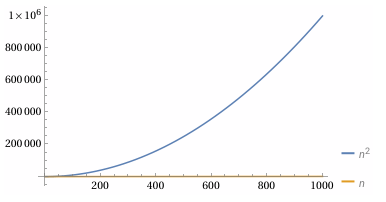

# Algorithms

>_<center>No raw loops.</center>_

The most important part of software development is computing _something_.
Algorithms are an abstraction of computation, and every program is an algorithm.
It is easy to be distracted by class hierarchies, software architecture, design
patterns, etc. Such things are helpful only insofar as they aid in
implementing a correct and efficient algorithm.

**Algorithm** (n.): _a process or set of rules to be followed in calculations or
other problem-solving operations, especially by a computer_ (New Oxford American
Dictionary).

When designing a program, we start with a statement of what the program will do,
and we refine that statement until we reach a level of detail sufficient to
begin the implementation. The process is iterative as we discover details that
inform and change the overall design.

For each component of the design, we will have a statement of what the component
is or does. Components that _do_ something are operations, and the statement of
what they do form the basis for the operations contract.

Consider a simple example. Suppose we are building a small drawing tool and want
to remove a selected shape from an array. The naive implementation is a loop
that scans for the shape and erases it.

```swift
/// Removes the selected shape.
func removeSelected(shapes: inout [Shape]) {
    for i in 0..<shapes.count {
        if shapes[i].isSelected {
            shapes.remove(at: i)
            break
        }
    }
}
```

Extend the requirement: the user can now select multiple shapes. The loop becomes more complicated. Removing one element shifts the indices of the remaining ones, so the loop must compensate.

```swift
/// Remove all selected shapes. (BAD)
func removeAllSelected(shapes: inout [Shape]) {
    var i = 0
    while i < shapes.count {
        if shapes[i].isSelected {
            shapes.remove(at: i)
            // Don't increment i; the next element is now at position i
        } else {
            i += 1
        }
    }
}
```

We could simplify the loop by reversing the direction of iteration, since only
subsequent indices are affected by the removal.

```swift
/// Remove all selected shapes. (BAD)
func removeAllSelected(shapes: inout [Shape]) {
    for i in (0..<shapes.count).reversed() {
        if shapes[i].isSelected {
            shapes.remove(at: i)
        }
    }
}
```

This code is simpler, but it still suffers from multiple problems. The performance is
quadratic, for each selected item we perform a remove which is linear with
the number of subsequent elements and the collection needs to be queried for
the count at each step (or we could track it separately), because it could change, which adds constant time
overhead.



At scale, quadratic behavior will make our application unusable. With just a
thousand elements, the scaling issue is apparent.

Real programs rarely need a single loop. They need several: one loop to find
something, another to remove it, another to insert it somewhere else, and
perhaps another to repair the structure afterward.

## From Mechanism to Intent

There is an algorithm known as half-stable partition which can be used to remove
the elements in linear time. The trick is to walk two indices forward so the
first index finds the next element to remove, and the second one points to
subsequent element to keep. Then we swap the elements and proceed end. Then we
can remove all the elements at the end.

```swift
/// Remove all selected shapes.
func removeAllSelected(shapes: inout [Shape]) {
    var writeIndex = 0
    
    for readIndex in 0..<shapes.count {
        if !shapes[readIndex].isSelected {
            if writeIndex != readIndex {
                shapes.swapAt(writeIndex, readIndex)
            }
            writeIndex += 1
        }
    }
    
    // Remove all selected shapes from the end
    shapes.removeSubrange(writeIndex...)
}
```

<!-- factor out half stable partition -->

Once we encapsulate the loops, the operations become simple.


A rotation
expresses “move this range here.” A stable partition expresses “collect the
elements that satisfy this predicate.” A slide is a composition of rotations. A
gather is a composition of stable partitions.

The loops are still there. They are no longer our problem.

Real programs rarely need a single loop. They need several: one loop to find
something, another to remove it, another to insert it somewhere else, and perhaps another to repair the structure afterward.

Each loop is simple in isolation. Together they form a fragile tangle of index
adjustments, off‑by‑one corrections, and implicit assumptions about the state of
the data.

A loop is a mechanism. It tells the computer *how* to step, but it does not tell
the reader *what* is being computed.

The problem is not the loops themselves. The problem is that they are exposed.
They are raw. They are unencapsulated.

Encapsulation is the difference between a loop and an algorithm. A loop is a
mechanism. An algorithm is a named, reusable composition that hides the
mechanism and exposes the intent.

A raw loop is a loop that appears directly in application code. It exposes
mechanics instead of intent. It forces the reader to reason about control flow
instead of the operation being performed. Raw loops are unencapsulated loops.

When I say “no raw loops,” I do not mean “no loops.” Every algorithm contains
loops. The problem is not iteration; the problem is exposure. A raw loop is a
loop that appears in application code, unencapsulated, forcing the reader to
reason about mechanics instead of intent. Real operations often require several
loops—one to find something, another to remove it, another to insert it
somewhere else. Left raw, these loops accumulate into brittle, low-level code.
Encapsulated as algorithms, they become simple, composable building blocks.

We do not avoid loops. We avoid exposing them.

Sorting is another encapsulated loop. It hides a complex algorithm behind a
single name. Once the data is sorted, other algorithms—binary search,
lower bound—become possible. Structure enables composition.


# From here down are notes and experiments

# Algorithms
## From Mechanism to Intent
A loop is a mechanism a named algorithm is a statement of intent.
## Discovering Algorithms
Discover and not invent - learning to decompose problems and compose algorithms.
## Generalizing Algorithms
`slide` and `gather`? Very loosely cover generics but the principals of generic programming will come in with the type chapter.
## Algorithmic Tradeoffs and Complexity
## Algorithms Form a Vocabulary
## Structure as Algorithmic Leverage
I want to cover an example of structuring data to make other algorithms more
efficient - maybe sort and lower-bound or the binary-search "heap" like
structure with lower-bound to show constant time efficient gains. This section
will bridge to the data structure chapter.

<!-- This is my outline with AI generated wording. Its generally horrible but some aspect may are useful. -->
# Algorithms
<center>No raw loops.</center>

Software exists to compute. Everything else—types, classes, modules, architecture—is scaffolding around that central act. An algorithm is the abstraction of that act: a precise, repeatable composition of operations that transforms input into output. Every program is an algorithm, and every algorithm is a composition.

Raw loops hide this. A loop is a mechanism, not an idea. It tells the computer *how* to step, but it does not tell the reader *what* is being computed. This chapter is about replacing mechanisms with ideas—about expressing computation in terms of named, reusable algorithms rather than ad‑hoc control flow.

## From Mechanism to Intent

Consider a simple example. Suppose we are building a small drawing tool and want to remove a selected shape from an array. The naive implementation is a loop that scans for the shape and erases it. It works, but the loop obscures the intent: “remove this element.”

Extend the requirement: the user can now select multiple shapes. The naive loop becomes more complicated. Removing one element shifts the indices of the remaining ones, so the loop must compensate. Reversing the iteration order avoids the index drift, but the algorithm is still quadratic. The code is longer, more fragile, and no clearer about what it is trying to do.

This is the cost of working at the level of mechanisms. The problem is not the example; the problem is the approach.

## Algorithms Capture Patterns

A better approach is to express the operation directly: “keep the shapes that are not selected.” This is a partitioning problem. A half‑stable partition moves the elements we want to keep to the front and the ones we want to discard to the back. After that, removing the tail is trivial.

This is exactly what `delete_if` does. It is a named, reusable algorithm that captures a common pattern of computation. It replaces a fragile loop with a clear statement of intent.

The important point is not the specific algorithm. It is the shift in thinking: from manipulating indices to expressing a transformation.

## Discovering Algorithms Through Composition

As programs grow, we encounter new operations that are awkward to express with raw loops. Suppose we want to move a selected element to a new position. One way is to copy it out, erase it, and insert it back. This works, but it decomposes the operation into low‑level steps. The code describes the mechanics, not the intent.

A better expression of the intent is rotation. A rotation shifts a block of elements while preserving their order. Moving one element is a rotation of a block of size one. Moving several consecutive elements is the same pattern. The algorithm is the idea: “rotate this range so that these elements end up here.”

Rotation is a more powerful building block than a hand‑rolled loop. It composes cleanly with other algorithms, and it generalizes.

## Generalizing Patterns: `slide` and `gather`

Once we recognize rotation as the underlying pattern, we can name the operation we actually want: sliding a range of elements to a new position. A `slide` algorithm expresses this directly. It takes a range and a target position and performs the appropriate rotation. The code is short, the intent is clear, and the algorithm is reusable.

Sometimes the elements we want to move are not consecutive. We can still express the operation in terms of existing algorithms. A stable partition can collect (“gather”) the selected elements into a contiguous block. Once gathered, a single slide moves them as a unit. This yields a `gather` algorithm: a composition of two stable partitions and a slide.

None of these algorithms depend on shapes. They depend only on iterators and predicates. They are generic. They capture patterns of computation that appear in many domains.

This is the power of algorithmic thinking: we discover general solutions by abstracting from specific problems.

## Algorithmic Tradeoffs and Guarantees

For many problems, there is more than one algorithm. Each has different tradeoffs. Some algorithms are greedy; some are lazy. Some operate in place; others require additional storage. Some require only forward iteration; others rely on random‑access.

Rotation is a good example. With forward iterators, rotation requires repeated swaps and is linear in the size of the range. With random‑access iterators, we can rotate more efficiently by reversing subranges. The stronger the guarantees on the types, the more efficient the algorithm can be.

Choosing the right algorithm requires understanding these tradeoffs. This is part of the craft of programming: matching the problem to the algorithmic vocabulary.

## Algorithms Form a Vocabulary

Algorithms are not limited to rearranging elements in a container. Numeric algorithms, graph algorithms, geometric algorithms, and string algorithms are all compositions of operations. Even `swap` is an algorithm: a minimal, correct, reusable composition.

As our vocabulary grows, we can express more ideas directly. We write less code, and the code we write is clearer. We stop thinking in terms of loops and start thinking in terms of transformations.

## Structure as Algorithmic Leverage

Sometimes the best way to improve an algorithm is to change the shape of the data. Consider searching for a value in a range. A linear search is simple but takes time proportional to the size of the range. If we sort the data, we impose a structure: if `i < j`, then `a[i] <= a[j]`. This structure enables binary search, which finds a value in logarithmic time.

The algorithm did not change; the data did. By structuring the data, we made a more efficient algorithm possible.

This is a general principle: data structure is algorithmic leverage. The representation of the data determines which algorithms are available and how efficient they can be.

## Bridge to the Next Chapter

Sorting is the simplest example of structuring data to enable efficient algorithms. More sophisticated structures—trees, heaps, hash tables—provide even more leverage. They make certain operations fast by organizing data in ways that algorithms can exploit.

The next chapter explores these structures. Here, we have focused on the algorithms themselves: named, reusable compositions that express intent, improve clarity, and enable efficient computation.


###

<!-- Test to get swift embedded in mdbook, need to build the infrastructure for testing swift code.-->
```swift
{{#include test.swift:2:5}}
```

```swift
func partitionPoint<T>(_ array: [T], _ predicate: (T) -> Bool) -> Int {
    var left = 0
    var right = array.count
    while left < right {
        let mid = (left + right) / 2
        if predicate(array[mid]) {
            left = mid + 1
        } else {
            right = mid
        }
    }
    return left
}

let array = [1, 2, 3, 4, 5, 5, 5, 6, 7, 8, 9, 10]
let index = partitionPoint(array, { $0 <= 5 }) // lower bound?
```

### Algorithm categories

I want to mention categories but and the importance of developing taxonomies to
assist you in finding an algorithm to solve a problem.

- Permutations
- Closed-Form Algorithms
- Sequential Algorithms
- Composition
- Algorithmic Forms
   - In-Place
   - Functional
      - Eager
      - Lazy

## Efficiency
